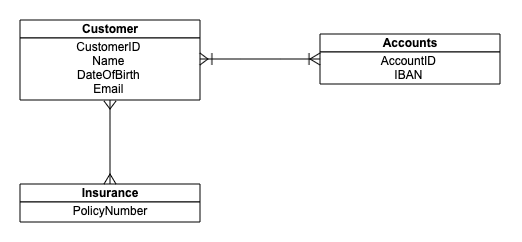

# Customer Information Service

In our bank we need to build an application for exposing customer information via REST api.
This application needs to get data from Database and other external systems via REST api calls.
It will gather details from following systems.

### Database - Entity Retationship Diagram

### Accounts API

The get-accounts API will provide the balances for the requested accounts (IBANS) retrieved from the database.
Sample request and response is available here. [Sample Response Json](./accounts)
Sample spring cloud contract - [Cloud contract](contracts/accounts.groovy)
 
### Insurances API

The get-insurances API will provide the insurance information of the customer based on policy number.
Sample request and response is available here. [Sample Response Json](./insurances)
Sample spring cloud contract - [Cloud contract](contracts/insurances.groovy)

## Assignment

1. Design your own rest API specification for this service.
2. Based on the sample requests and responses provided, create a stub application for external calls (/accounts and /insurances API).
3. Think about non-functional requirements such as performance.

## Instructions

* Assignment should be submitted as a maven project.
* Use in-memory database.
* Junit should be well written.
* Integration test should be implemented.
* Share the project with us as a git bundle.

### How to create a git bundle
* Run `git bundle create <assignment-name>.bundle <branch>` to create a git bundle.
* Run `git clone <assignment-name>.bundle` to un-bundle the repo.
* Please find more info about git bundle here - https://git-scm.com/docs/git-bundle

